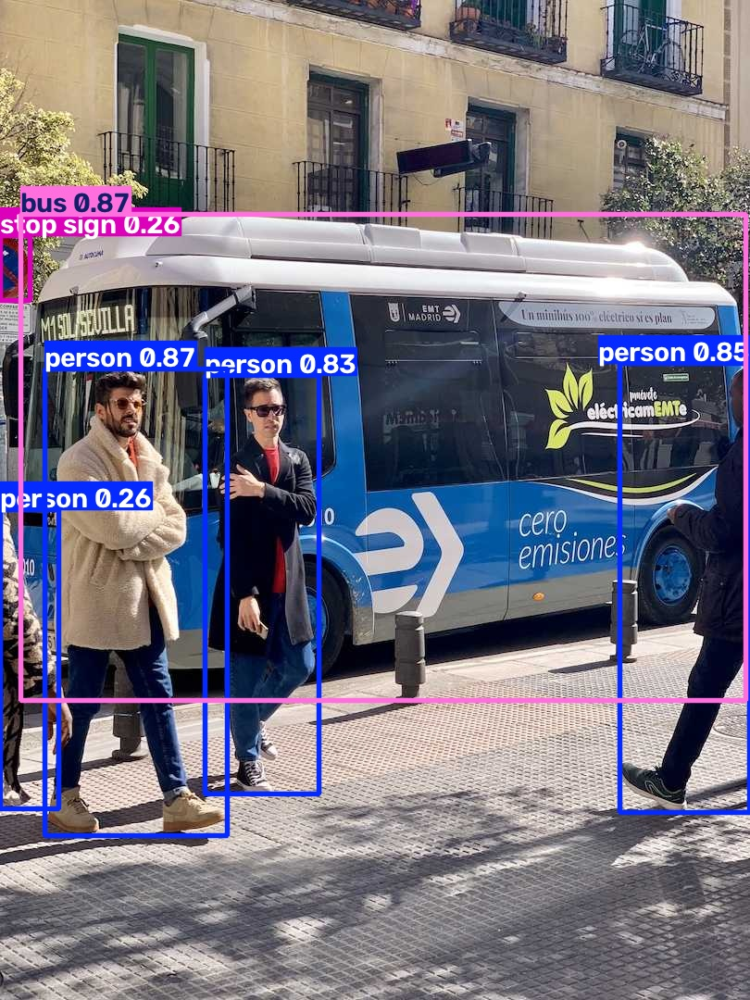

# First Detection Model: A YOLOv8 Quickstart

This repository contains a quickstart project demonstrating basic object detection using YOLOv8, completed as part of the μLearn Foundation AI enablement task.

- **Hashtag**: `#cl-ai-yoloquickstart`
- **Interest Group**: AI
- **Task**: First Detection Model

---

## Output Result

The model runs object detection on the sample image and produces bounding boxes, labels, and confidence scores:



---

## Project Structure

```
.
├── detect.py          # Script to load YOLOv8n, run inference, and save detections
├── requirements.txt   # Required Python dependencies (ultralytics)
├── results.jpg        # Final output image with detected bounding boxes
├── .gitignore         # Git ignore rules for virtual environment and weights
└── README.md          # Documentation
```

---

## Setup and Execution

### 1. Create and Activate Virtual Environment

**Windows (PowerShell):**
```powershell
python -m venv .venv
.\.venv\Scripts\Activate.ps1
```

**Linux / macOS:**
```bash
python3 -m venv .venv
source .venv/bin/activate
```

### 2. Install Dependencies

```bash
pip install -r requirements.txt
```

### 3. Run Inference

```bash
python detect.py
```

The script will automatically download the `yolov8n.pt` weights if not already present, run detection on the input image, and output `results.jpg` in the project root directory.
